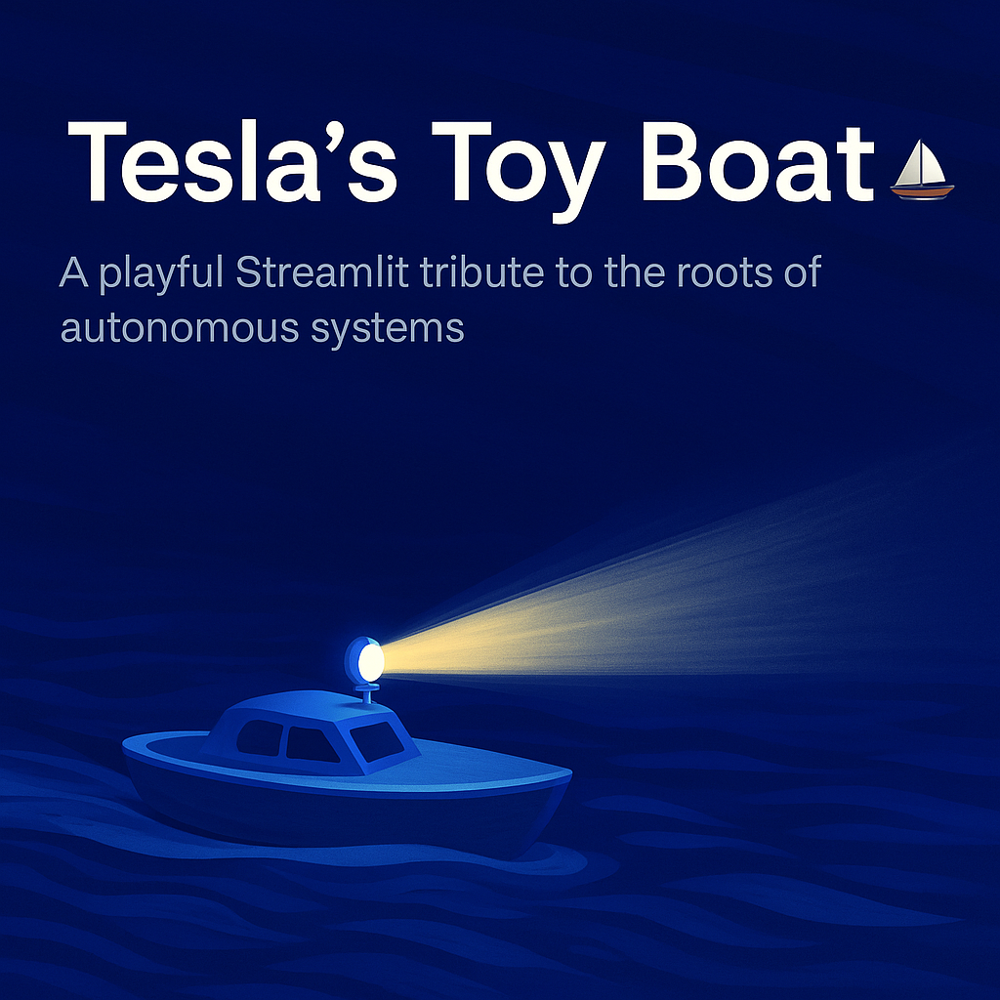

Tesla’s Toy Boat ⛵️

A playful Streamlit app inspired by Nikola Tesla’s 1898 radio-controlled boat

⸻

📖 About

This project is a fun, interactive simulation of Tesla’s Toy Boat, built with Streamlit and modern web technologies. You pilot a small boat around a pond, collecting colorful buoys while avoiding reeds.

The app is designed to be:
	•	Playful & colorful – a lighthearted tribute to Tesla’s invention.
	•	Mobile-friendly – with on-screen D-pad or Joystick controls.
	•	Immersive – complete with sounds, haptics (on supported devices), and a glowing lamp beam.

⸻

✨ Features
	•	Sidebar controls
	•	Buoy goal (win condition).
	•	Total buoys and reeds (hazards).
	•	Boat max speed and water drag.
	•	Control mode: D-pad or Joystick.
	•	On-screen HUD
	•	Score and speed display pinned bottom-right in the pond.
	•	Victory banner when you win.
	•	Controls
	•	Arrow keys on desktop.
	•	On-screen D-pad or Joystick (switchable).
	•	Lamp button:
	•	Tap to toggle ON/OFF.
	•	Press & hold to keep it ON while held.
	•	Keyboard T also toggles.
	•	Restart button resets the game.
	•	Mute/Unmute toggle for sound.
	•	Effects
	•	Lamp glow with a bright halo and forward beam.
	•	Water ripples around the boat.
	•	Haptic buzz + beep when collecting buoys (if supported).

🎮 Gameplay
	•	Navigate the boat to collect all buoys.
	•	Avoid reeds (they slow you down).
	•	Toggle the Lamp to light your way.
	•	Reach the buoy goal to achieve Victory!

⸻

📜 Credits
	•	Inspired by Nikola Tesla’s 1898 demonstration of a radio-controlled boat.
	•	Built with Streamlit, HTML5 canvas, and JavaScript.
	•	Royal blue theme for a modern look.
